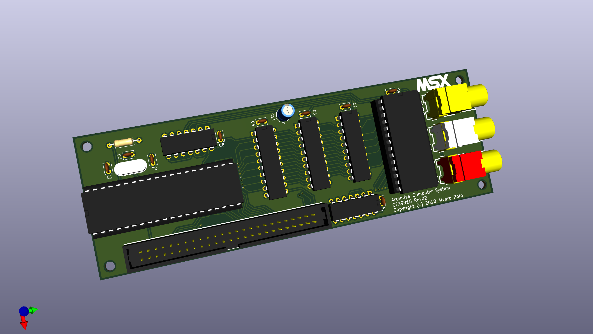

# Artemisa MSX Computer System - Video Display Processor

Artemisa is designed to allow a variety of different VDPs to be used with it. In order to have this, the VDP circuitry is completely separated from the rest of the computer. So customers can choose the graphics card that better fits their needs.

## Interface

The interface used to communicate the Artemisa computer motherboard and the graphics card is basically a modification of a de facto standard for a expansion bus:

  https://www.msx.org/wiki/Expansion_bus_slots

Artemisa considers the following modifications to the specs described in above link:

* The line 16, which is reserved according to the standard, will be used to transmit the /VDPIOSEL signal. This will be active by the computer when IO ports 98h to 9Fh are selected with /IORQ active and /M1 inactive (i.e., a IO request to the VDP ports).
* As usual in Artemisa, +12v and -12v power signals are disconnected.

Thanks to that, the graphics card can use a great variety of possible IO, and even memory, communications. From the simplest graphic card with a TMS9918 VDP mapped in ports 98h and 99h, to the most sophisticated combination of V9990 chips. 

## Available graphics cards

### GFX 9918

This is the most basic graphics card available. It provides a TMS-9918 chip with the following characteristics:

* 16KB of static VRAM in a single chip (62256, actually of 32KB but half of them unused). 
* 60Hz NTSC composite video output. 

Simple, cheap, and easy to find materials. 
